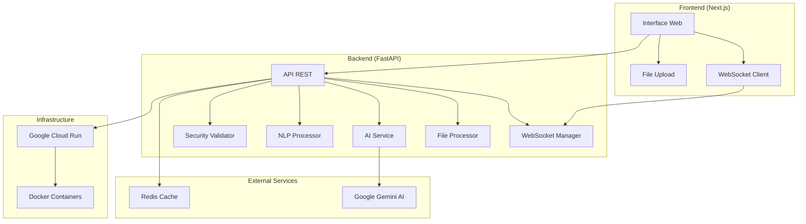

# 🤖 AInBox - Sistema de Análise Inteligente de E-mails

<div align="center">


**Sistema completo de análise de e-mails com IA, processamento de linguagem natural e interface web moderna**

[](https://fastapi.tiangolo.com/)
[](https://nextjs.org/)
[](https://ai.google.dev/)
[](https://cloud.google.com/run)

</div>

---

## 🎯 Proposta do Projeto

O **AInBox** é uma solução completa para análise inteligente de e-mails que combina **Inteligência Artificial**, **Processamento de Linguagem Natural** e **WebSockets** para fornecer análises em tempo real. O sistema classifica e-mails automaticamente, gera sugestões de resposta e oferece insights sobre o conteúdo através de uma interface web moderna.

### ✨ Principais Funcionalidades

- 🔍 **Análise Inteligente**: Classificação automática de e-mails usando Google Gemini AI
- 📝 **Sugestões de Resposta**: Geração automática de respostas contextualizadas
- 🌐 **Processamento Multilíngue**: Suporte a português e inglês com detecção automática
- 📊 **Análise de Sentimento**: Avaliação emocional do conteúdo dos e-mails
- ⚡ **Tempo Real**: Comunicação via WebSockets para feedback instantâneo
- 📁 **Upload de Arquivos**: Suporte a PDFs e arquivos de texto
- 🔒 **Rate Limiting**: Controle de taxa de requisições para estabilidade
- 🐳 **Containerização**: Deploy simplificado com Docker

---

## 🏗️ Arquitetura do Sistema



---

## 🛠️ Stack Tecnológica

### Backend

- **FastAPI** - Framework web moderno e performático
- **Google Gemini AI** - Motor de IA para análise de conteúdo
- **NLTK** - Processamento de linguagem natural
- **Redis** - Cache e rate limiting
- **WebSockets** - Comunicação em tempo real
- **Pydantic** - Validação de dados
- **Uvicorn** - Servidor ASGI

### Frontend

- **Next.js 14** - Framework React com SSR/SSG
- **TypeScript** - Tipagem estática
- **Tailwind CSS** - Estilização utilitária
- **Radix UI** - Componentes acessíveis
- **WebSocket API** - Comunicação em tempo real

### Infraestrutura

- **Docker** - Containerização
- **Docker Compose** - Orquestração local
- **Google Cloud Run** - Deploy serverless
- **Google Cloud Build** - CI/CD automatizado

---

## 🚀 Como Executar Localmente

### Pré-requisitos

- Docker e Docker Compose
- Chave da API do Google Gemini

### 1. Clone o Repositório

```bash
git clone https://github.com/seu-usuario/ainbox.git
cd ainbox
```

### 2. Configure a Chave da API

```bash
# Edite o arquivo backend/.env
cp backend/env.example backend/.env
# Adicione sua chave do Google Gemini
```

### 3. Execute com Docker Compose

```bash
# Inicie todos os serviços
docker-compose up --build

# Ou execute em background
docker-compose up --build -d
```

### 4. Acesse a Aplicação

- **Frontend**: http://localhost:3000
- **Backend API**: http://localhost:8000
- **Documentação**: http://localhost:8000/docs

---

## 📋 Decisões de Projeto Importantes

### 🔄 Processamento Assíncrono

- **Background Tasks**: Processamento de arquivos não bloqueia a API
- **WebSockets**: Feedback em tempo real para o usuário
- **Rate Limiting**: Prevenção de sobrecarga do sistema

### 🧠 Processamento de IA

- **Google Gemini**: Escolhido por sua capacidade multilíngue e qualidade de resposta
- **Pré-processamento NLTK**: Limpeza e normalização de texto antes da análise
- **Contexto Dinâmico**: Suporte a contexto adicional para melhor precisão

### 🔒 Segurança

- **Validação de Arquivos**: Verificação de tipos e tamanhos permitidos
- **CORS Configurado**: Controle de acesso cross-origin
- **Rate Limiting**: Proteção contra abuso da API

### ⚡ Performance

- **Redis Cache**: Aceleração de respostas frequentes
- **Processamento Paralelo**: Múltiplos e-mails processados simultaneamente
- **Containerização**: Deploy consistente e escalável

---

## 📁 Estrutura do Projeto

```
ainbox/
├── backend/                 # API FastAPI
│   ├── app/
│   │   ├── api/            # Endpoints da API
│   │   ├── core/           # Configurações
│   │   ├── services/       # Serviços de negócio
│   │   └── websocket/      # Gerenciamento WebSocket
│   ├── Dockerfile
│   └── requirements.txt
├── frontend/               # Interface Next.js
│   ├── app/
│   ├── components/
│   ├── lib/
│   └── Dockerfile
├── docker-compose.yml      # Orquestração local
└── README.md              # Este arquivo
```

---

## 🔗 Links Úteis

- [Documentação da API](http://localhost:8000/docs) - Swagger UI
- [Frontend README](./frontend/README.md) - Detalhes do frontend
- [Backend README](./backend/README.md) - Arquitetura do backend
- [Google Gemini AI](https://ai.google.dev/) - Documentação da IA
- [FastAPI Docs](https://fastapi.tiangolo.com/) - Framework backend

---

## 📄 Licença

Este projeto está sob a licença MIT. Veja o arquivo [LICENSE](LICENSE) para mais detalhes.

---

<div align="center">

**Desenvolvido com ❤️ para análise inteligente de e-mails**

[](https://github.com/seu-usuario/ainbox)
[](https://github.com/seu-usuario/ainbox/issues)

</div>
