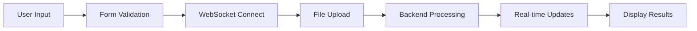

# 🎨 AInBox Frontend

Interface web moderna para o sistema de análise inteligente de e-mails AInBox, construída com Next.js 14 e TypeScript.

## 🚀 Tecnologias Utilizadas

### Core Framework

- **Next.js 14** - Framework React com App Router
- **TypeScript** - Tipagem estática para maior confiabilidade
- **React 18** - Biblioteca de interface de usuário

### Estilização e UI

- **Tailwind CSS** - Framework CSS utilitário
- **Radix UI** - Componentes acessíveis e customizáveis
- **Lucide React** - Ícones modernos e consistentes
- **clsx** - Utilitário para classes CSS condicionais

### Comunicação

- **WebSocket API** - Comunicação em tempo real com o backend
- **Fetch API** - Requisições HTTP para upload de arquivos

## 📁 Estrutura do Projeto

```
frontend/
├── app/
│   ├── globals.css          # Estilos globais
│   ├── layout.tsx           # Layout raiz da aplicação
│   └── page.tsx             # Página principal
├── components/
│   └── ainbox-interface.tsx # Componente principal da interface
├── lib/
│   └── utils.ts             # Utilitários (cn function)
├── public/                  # Arquivos estáticos
├── .env.local              # Variáveis de ambiente locais
├── next.config.mjs         # Configuração do Next.js
├── package.json            # Dependências e scripts
├── tsconfig.json           # Configuração do TypeScript
└── Dockerfile              # Containerização
```

## 🎯 Componentes Principais

### AInBoxInterface

Componente principal que gerencia toda a interface do usuário:

```typescript
interface AInBoxInterfaceProps {
  // Props do componente principal
}
```

**Funcionalidades:**

- ✅ Upload de arquivos (PDF, TXT)
- ✅ Input de texto para e-mails
- ✅ Conexão WebSocket em tempo real
- ✅ Exibição de resultados de análise
- ✅ Gerenciamento de estado da aplicação
- ✅ Feedback visual de progresso

## 🔧 Configuração

### Variáveis de Ambiente

```bash
# .env.local
NEXT_PUBLIC_API_BASE_URL=http://localhost:8000
```

### Configuração do Next.js

```javascript
// next.config.mjs
const nextConfig = {
  env: {
    NEXT_PUBLIC_API_BASE_URL:
      process.env.NEXT_PUBLIC_API_BASE_URL || "http://localhost:8000",
  },
  // ... outras configurações
};
```

## 🌐 Comunicação com Backend

### WebSocket Connection

```typescript
const connectWebSocket = (): Promise<string> => {
  return new Promise((resolve, reject) => {
    const apiUrl =
      process.env.NEXT_PUBLIC_API_BASE_URL ||
      "https://ainbox-backend-356969755759.southamerica-east1.run.app";
    const wsUrl = apiUrl.replace(/^http/, "ws");
    const ws = new WebSocket(`${wsUrl}/ws`);
    // ... lógica de conexão
  });
};
```

### API Requests

```typescript
const handleSend = async () => {
  const apiUrl =
    process.env.NEXT_PUBLIC_API_BASE_URL ||
    "https://ainbox-backend-356969755759.southamerica-east1.run.app";
  const response = await fetch(`${apiUrl}/api/v1/analysis`, {
    method: "POST",
    body: formData,
  });
  // ... processamento da resposta
};
```

## 🎨 Interface do Usuário

### Design System

- **Cores**: Paleta consistente com tons de azul e cinza
- **Tipografia**: Fonte system com fallbacks
- **Espaçamento**: Sistema de espaçamento baseado em Tailwind
- **Componentes**: Reutilizáveis e acessíveis

### Estados da Interface

1. **Inicial**: Formulário de upload e input de texto
2. **Conectando**: Indicador de conexão WebSocket
3. **Processando**: Barra de progresso e feedback visual
4. **Resultado**: Exibição dos resultados da análise
5. **Erro**: Mensagens de erro com opção de retry

## 📱 Responsividade

A interface é totalmente responsiva e funciona em:

- 📱 **Mobile**: Layout adaptado para telas pequenas
- 💻 **Desktop**: Interface completa com todas as funcionalidades
- 🖥️ **Tablet**: Layout intermediário otimizado

## 🔄 Fluxo de Dados



## 🚀 Scripts Disponíveis

```bash
# Desenvolvimento
pnpm dev          # Servidor de desenvolvimento
pnpm build        # Build de produção
pnpm start        # Servidor de produção
pnpm lint         # Verificação de código

# Docker
docker build -t ainbox-frontend .  # Build da imagem
docker run -p 3000:3000 ainbox-frontend  # Executar container
```

## 🐳 Docker

### Dockerfile Multi-stage

```dockerfile
# Estágio 1: Dependências
FROM node:18-alpine AS deps
RUN npm install -g pnpm
COPY package.json pnpm-lock.yaml ./
RUN pnpm install --no-frozen-lockfile

# Estágio 2: Build
FROM node:18-alpine AS builder
COPY --from=deps /app/node_modules ./node_modules
COPY . .
ENV NEXT_PUBLIC_API_BASE_URL=http://localhost:8000
RUN pnpm build

# Estágio 3: Produção
FROM node:18-alpine AS runner
COPY --from=builder /app/.next ./.next
COPY --from=builder /app/node_modules ./node_modules
EXPOSE 3000
CMD ["pnpm", "start"]
```

## 🔧 Desenvolvimento

### Estrutura de Componentes

```typescript
// Componente principal com hooks
const AInBoxInterface = () => {
  const [wsConnection, setWsConnection] = useState<WebSocket | null>(null);
  const [connectionId, setConnectionId] = useState<string | null>(null);
  const [isConnected, setIsConnected] = useState(false);
  const [isProcessing, setIsProcessing] = useState(false);
  const [results, setResults] = useState<AnalysisResult[]>([]);
  const [error, setError] = useState<string | null>(null);

  // ... lógica do componente
};
```

### Gerenciamento de Estado

- **useState**: Estado local dos componentes
- **useEffect**: Efeitos colaterais e lifecycle
- **Custom Hooks**: Lógica reutilizável (futuro)

## 🎯 Funcionalidades Implementadas

### ✅ Upload de Arquivos

- Suporte a PDF e TXT
- Validação de tipos de arquivo
- Preview de arquivos selecionados
- Drag & drop interface

### ✅ Input de Texto

- Textarea para e-mails em texto
- Validação de conteúdo
- Suporte a múltiplos e-mails

### ✅ WebSocket Real-time

- Conexão automática
- Reconexão em caso de falha
- Heartbeat para manter conexão ativa
- Feedback visual de status

### ✅ Exibição de Resultados

- Cards organizados por e-mail
- Classificação visual (cores)
- Sugestões de resposta
- Análise de sentimento
- Metadados de processamento

## 🔮 Melhorias Futuras

- [ ] **PWA Support**: Aplicação web progressiva
- [ ] **Offline Mode**: Funcionalidade offline
- [ ] **Dark Mode**: Tema escuro
- [ ] **Export Results**: Exportar resultados
- [ ] **History**: Histórico de análises
- [ ] **Templates**: Templates de resposta
- [ ] **Multi-language**: Suporte a múltiplos idiomas

## 📚 Dependências Principais

```json
{
  "dependencies": {
    "next": "14.2.16",
    "react": "^18.3.1",
    "react-dom": "^18.3.1",
    "@radix-ui/react-dialog": "^1.0.5",
    "@radix-ui/react-progress": "^1.0.3",
    "@radix-ui/react-toast": "^1.1.5",
    "tailwind-merge": "^2.2.1",
    "clsx": "^2.1.0",
    "lucide-react": "^0.363.0"
  }
}
```

## 🐛 Troubleshooting

### Problemas Comuns

**WebSocket não conecta:**

- Verifique se `NEXT_PUBLIC_API_BASE_URL` está configurada
- Confirme se o backend está rodando
- Verifique logs do console para erros

**Upload de arquivos falha:**

- Verifique tipos de arquivo permitidos
- Confirme tamanho máximo dos arquivos
- Verifique conexão com o backend

**Interface não carrega:**

- Execute `pnpm install` para instalar dependências
- Verifique se todas as variáveis de ambiente estão configuradas
- Confirme se o build foi executado corretamente

---

**Desenvolvido com ❤️ para uma experiência de usuário excepcional**
